# School_District_Analysis

## Overview of Project

**Purpose:**  
Maria works for the city school systems, she has asked us for help with performing an analysis on standardized testing scores for math and reading to help the school board on making decisions on school budgeting and priorities. The purpose of this project is to perform an analysis on student funding and discovering trends in school performances based on individual schools and at the district level.  

## Resources:
- Data Source: schools_complete.csv, students_complete.csv, clean_students_complete.csv
- Software: Python 3.9.7, Anaconda 4.10.3, Jupyter Notebook 6.4.5

## Analysis and Results

**Analysis:**  
For this analysis, we were provided with a dataset for students and a dataset for schools, students_complete.csv and schools_complete.csv respectively. The student information had information student name and ID, where the students went to school, both their math and reading grades, and their grade in school. The school dataset has information on the school name, the type of school (district or charter), number of students, and spending budget. With this information from our dataset, we are able to calculate number of students that passed math and reading, as well as passing both math and reading. A score of 70 or greater would be considered passing for this analysis. Once we have the number of students that are passing for each of those three categories, we can calculate the percent of passing by dividing by the total number of students in the district. Maria was also wanting us to analyze to see if there is a the relationship of test scores by school spending, by school size, and by school type. This would give her, as well as the school board, a better understanding if there is any impact on the students' test scores based on those individual factors.  

After performing the initial analysis, we were informed that test scores for 9th graders at Thomas High School were compromised. This means that we would have to perform another analysis without those test scores included in our dataset as it may change our end results. Fortunately for us, we can use this new found data and compare it to the first analysis that we performed to give a deeper understanding on how this impacts our overall results if in case something like this happens again in the future.  

**Results:**  
- How is the district summary affected?  
We can see that there is very minimal change across the board for average passing scores, passing percentage, and overall passing percentage. Per attached images, with the first image being from our inital analysis and the second image being from our recalculated results.  
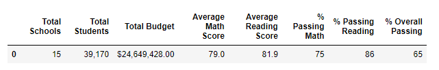  
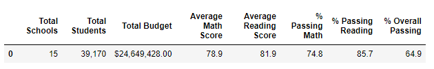  

- How is the school summary affected?  
After we removed the test scores from the 9th graders at Thomas High School, we performed the same calculations with the upperclass (10th through 12th graders). From our results, we noticed very minimal change in our data. Attached are 2 images of the top 5 schools in the district with the first image from our initial analysis, and the latter from our second analysis.  
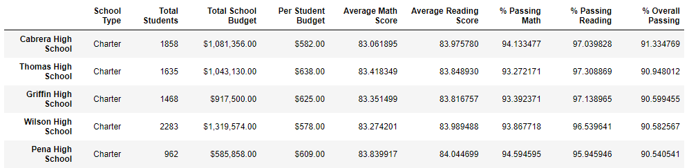  (NEED TO ADJUST TO MAKE SURE I HAVE THE RIGHT PICTURE)
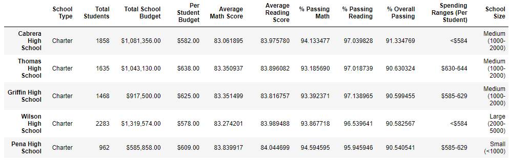  

- How does replacing the 9th graders' math and reading scores affect Thomas High School's performance relative to the other schools? 
As noted in the school summary above and the images above, there was minimal change in math and reading test scores, therefore there was no significant change in school performance relative to the other schools.  

- How does replacing the 9th graders' scores affect math and reading scores by grade?
Obviously, we replaced 9th grade test scores with "NaN" and we did not change anything with the upperclass test scores. Therefore the upperclass test scores had no change. But there was minimal change for ninth graders, with a change of -0.1% for reading and -0.2% for math. The first image is from our initial analysis, and the second image is from our second analysis.  
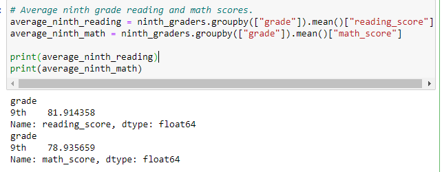  
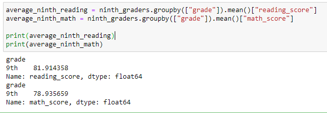  

- How does replacing the 9th graders' scores affect scores by school spending?
Scores by school spending was not affected when replacing 9th graders' scores with "NaN".  
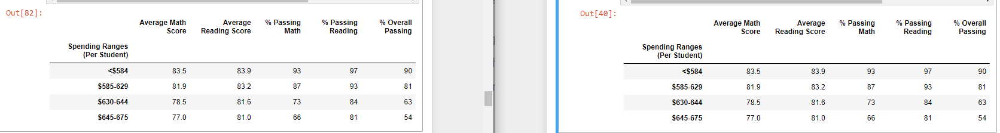  

- How does replacing the 9th graders' scores affect scores by school size?
Scores by school size was not affected when replacing 9th graders' scores with "NaN".  
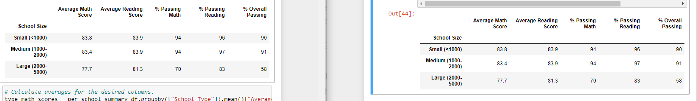  

- How does replacing the 9th graders' scores affect scores by school type?
Scores by school type was not affected when replacing 9th graders' scores with "NaN".  
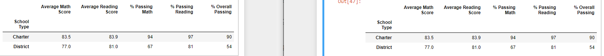  

## Challenge Summary

**Summary**  
For this analysis, we did a comparision of math, reading and both combined math and reading scores for 15 schools in a single school district. We used the standardized test score results to compared if there is any relationship for school spending, school size, or school type. For our analysis, we did not find any change or at least no significant changes in our results when comparing those data values. Part of why there may have been minimal change or if any change, would be because the school district has 39,170 students and only 461 students in the 9th grade at Thomas High School which only makes up ~1% of the population in our analysis. Another reason why there might be no change to minimal change could be related to the test scores of 9th graders that were taken out. Basically, we calculated the average and percent passing for both math and reading, which the average of the 9th graders at Thomas High School was ZZZ which is very close to the overall average to prior to their scores getting replaced. Therefore, we wouldn't expect much of a change at all.

### Codes Used  
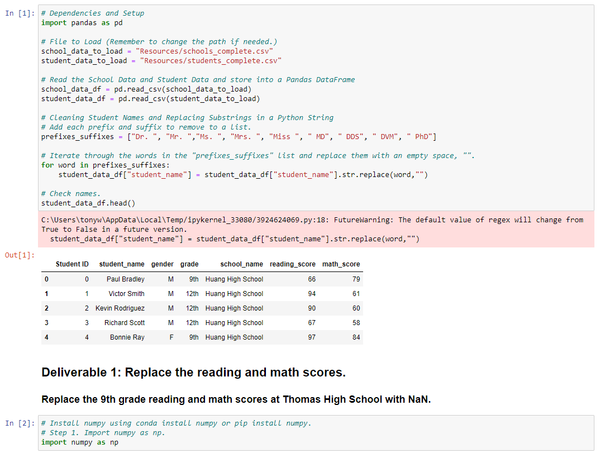  
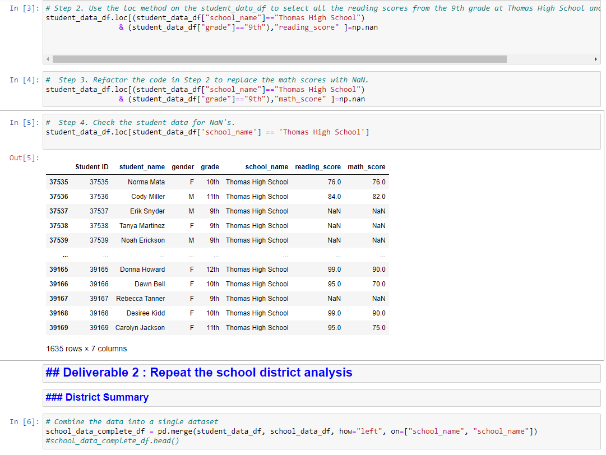  
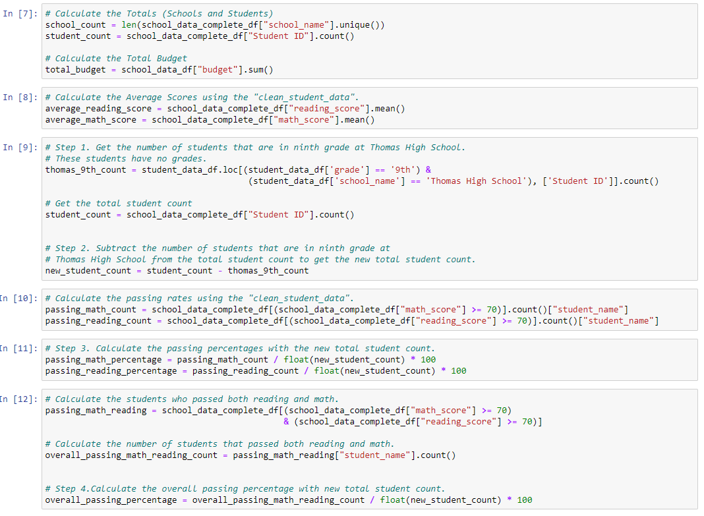  
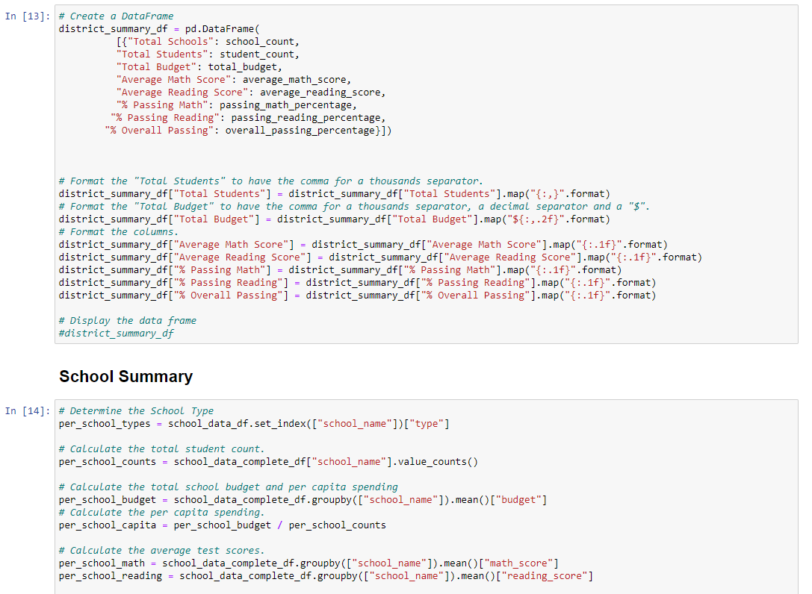  
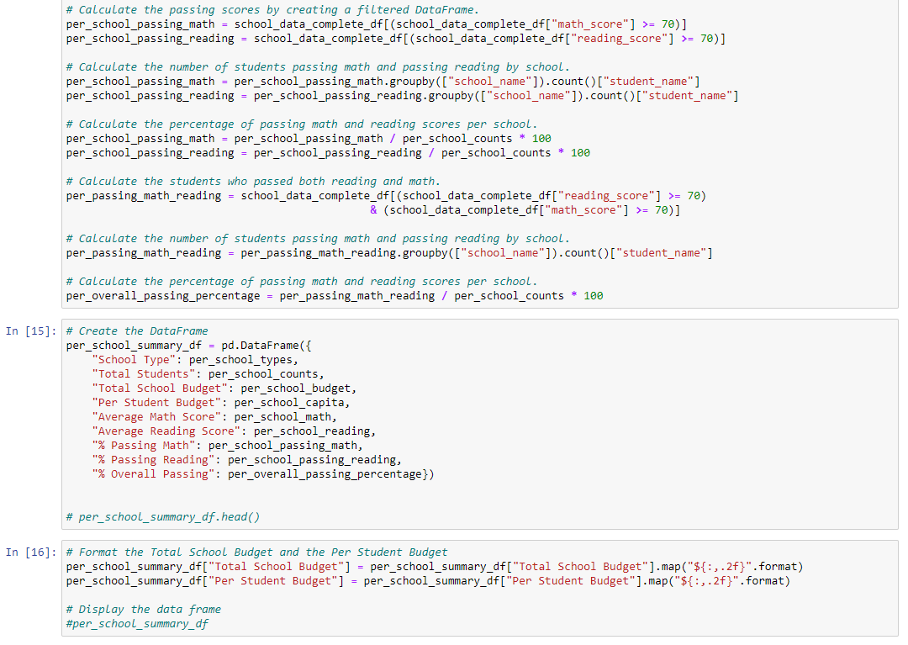  